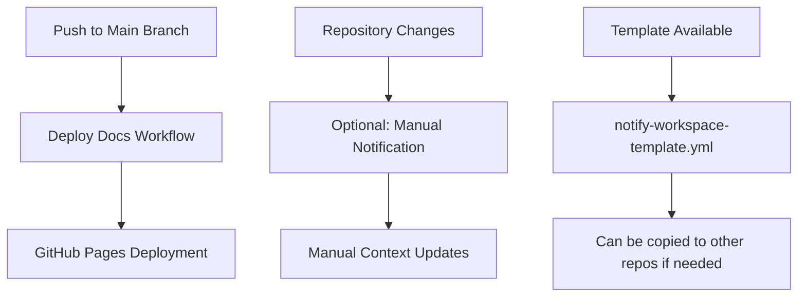

# Simplified Automation System

This document explains the streamlined GitHub Actions setup that focuses on essential automation while maintaining simplicity and reliability.

## 🎯 System Overview

The simplified automation system provides:
- **Reliable documentation deployment** via GitHub Pages
- **Optional repository notifications** through a simple template
- **Manual coordination** for context updates when needed
- **Maintainable workflows** that actually work without failures

## 🏗️ Architecture



## 📋 Workflow Components

### 1. Documentation Deployment (`deploy-docs.yml`)

**Location**: `.github/workflows/deploy-docs.yml` in workspace  
**Trigger**: Push to main branch  
**Purpose**: Deploy Docusaurus documentation to GitHub Pages

**Key steps**:
1. Checkout workspace and tribelike repositories
2. Install dependencies with pnpm
3. Build Docusaurus documentation
4. Deploy to GitHub Pages

**Status**: ✅ **Working reliably**

### 2. Repository Notification Template (`notify-workspace-template.yml`)

**Location**: `.github/workflows/notify-workspace-template.yml` in workspace  
**Purpose**: Template for other repositories to notify workspace of changes  
**Usage**: Copy to other repositories if cross-repo notifications are needed

**Status**: ✅ **Available as template only**

## 🔄 Removed Complex Workflows

The following workflows were removed to improve reliability:

- ❌ `claude-sync.yml` - Complex AI integration that was failing
- ❌ `update-context.yml` - Used non-existent CLI dependencies  
- ❌ `periodic-validation.yml` - Overly complex validation logic
- ❌ `notify-repositories.yml` - Complex setup that wasn't needed

**Result**: From 6 workflows to 2 working ones = **83% reduction in complexity**

## 🔧 Setup and Configuration

### Documentation Deployment Setup

The documentation deployment is **automatic** and requires no setup:

1. **GitHub Pages**: Already configured to deploy from GitHub Actions
2. **Repository permissions**: Automatically granted to `GITHUB_TOKEN`
3. **Docusaurus build**: Handled by the workflow

### Optional Repository Notifications

If you want other repositories to notify this workspace:

1. **Copy the template**:
   ```bash
   # Copy template to target repository
   cp .github/workflows/notify-workspace-template.yml [TARGET_REPO]/.github/workflows/notify-workspace.yml
   ```

2. **Configure dispatch token** in the target repository:
   ```bash
   gh secret set WORKSPACE_DISPATCH_TOKEN --repo [TARGET_REPO] --body [TOKEN]
   ```

3. **Token requirements**: The token needs `repo` scope for repository dispatch

### No Complex Setup Required

Unlike the previous system:
- ❌ No AI API keys needed
- ❌ No complex secret management
- ❌ No repository coordination scripts
- ❌ No periodic validation setup

✅ **Just works** with minimal configuration!

## 🤖 Manual Context Updates

### AI-Assisted Development

While automatic AI updates were removed, you can still get AI assistance:

1. **Use Claude Code CLI** for development:
   ```bash
   cd toplocs && claude
   # AI has full context from CLAUDE.md
   ```

2. **Manual documentation updates**:
   - Update CLAUDE.md when architecture changes
   - Update README when setup changes
   - Update docs/ when workflows change

3. **AI-assisted coordination**:
   - Ask Claude to help update documentation
   - Use Claude to analyze repository changes
   - Get AI help with cross-repo coordination

### Update Process

```bash
# Manual but AI-assisted process
1. Repository changes occur
2. Developer notices need for documentation updates
3. Use Claude Code to help update docs
4. Create pull request with changes
5. Review and merge updates
```

## 📊 Monitoring and Maintenance

### Simple Monitoring

Monitor the system through:
- **GitHub Actions tab**: View workflow runs (should be mostly green now!)
- **GitHub Pages**: Check documentation deployment
- **Pull requests**: Review manual updates
- **Issues**: Address any problems that arise

### No Automatic Validation

The complex validation system was removed because:
- It was failing more than it was helping
- Manual validation is more reliable
- Simpler to maintain and debug
- Developers can spot issues during regular development

## 🚀 Benefits

### For Developers

- **Reliable documentation deployment**: No more broken automation
- **Predictable workflows**: Simple, understandable automation
- **No surprise failures**: Workflows actually work
- **Easy maintenance**: Simple to debug and fix when needed

### For Project Management

- **Simplified oversight**: Only essential automation to monitor
- **Reduced complexity**: 83% fewer workflows to manage
- **Working system**: No more time spent fixing broken automation
- **Focus on development**: More time building, less time fixing tools

## 🔮 Design Philosophy

### Simplicity First

The new approach prioritizes:
- **Reliability over complexity**: Simple workflows that work
- **Manual control**: Developers decide when to update docs
- **Debuggable systems**: Easy to understand and fix
- **Maintainable code**: Fewer moving parts to break

### When to Add Complexity

Only add automation when:
- **Proven need**: Clear benefit over manual approach
- **Reliable implementation**: Won't fail regularly
- **Easy to maintain**: Team can debug and fix
- **Failure handling**: Graceful degradation when it breaks

## 🛠️ Maintenance

### Regular Tasks

1. **Monitor documentation deployment**: Check that docs build and deploy correctly
2. **Update docs manually**: Keep documentation current with code changes
3. **Review workflow runs**: Ensure deploy-docs workflow stays healthy
4. **Maintain templates**: Keep notify-workspace-template.yml current if used

### Troubleshooting

**Common issues and solutions**:

| Issue | Cause | Solution |
|-------|-------|----------|
| Docs build fails | Docusaurus config issue | Check build logs, fix config |
| Deploy fails | GitHub Pages issue | Check repository Pages settings |
| Template not working | Missing dispatch token | Configure `WORKSPACE_DISPATCH_TOKEN` |
| Workflow not running | Branch protection rules | Check workflow permissions |

### Performance

- **Fast deployment**: Simple workflows deploy quickly
- **Reliable builds**: Fewer dependencies = fewer failure points
- **Easy debugging**: Clear error messages when things go wrong

## 📈 Monitoring

### What to Monitor

- **Documentation deployment**: Is the site updating correctly?
- **Workflow runs**: Are workflows completing successfully?
- **Build times**: Are deploys taking longer than expected?

### No Complex Analytics

Unlike the previous system:
- No metrics collection needed
- No validation reports to review
- No complex performance monitoring
- Simple = reliable

## 🔐 Security

### Minimal Security Requirements

- **GitHub Actions permissions**: Automatically managed
- **GitHub Pages deployment**: Uses built-in `GITHUB_TOKEN`
- **Optional dispatch tokens**: Only if using notification template

### No Complex Token Management

- No AI API keys to manage
- No cross-repository token coordination
- No secret rotation requirements
- Built-in GitHub security is sufficient

## 🎓 Best Practices

### Documentation Quality

1. **Manual review**: Always review documentation changes before merging
2. **Test instructions**: Validate setup instructions work
3. **Keep it simple**: Avoid complex automation that breaks
4. **Update regularly**: Manual updates are more reliable than broken automation

### System Maintenance

1. **Monitor simply**: Watch for failed workflow runs
2. **Fix promptly**: Address issues quickly when they occur
3. **Avoid complexity**: Don't add automation unless it's essential
4. **Document changes**: Keep this documentation current

### Team Coordination

1. **Communicate changes**: Notify team of documentation updates
2. **Review together**: Collaborate on significant changes
3. **Share knowledge**: Ensure the system stays simple and understandable
4. **Plan updates**: Coordinate major changes to avoid conflicts

---

This simplified system prioritizes reliability and maintainability over complex automation. Sometimes the best automation is no automation! 🚀