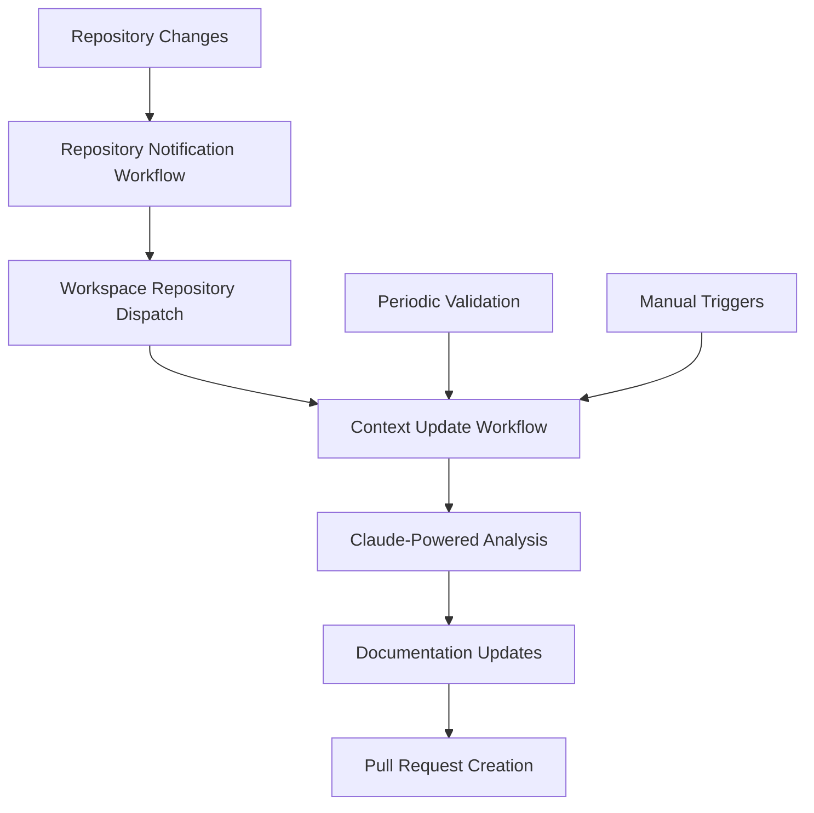

# Automated Context Updates System

This document explains the GitHub Actions-powered system that automatically keeps the TopLocs workspace documentation current with changes across all ecosystem repositories.

## 🎯 System Overview

The automated context update system ensures that:
- **AI development context remains current** with code changes
- **Documentation stays synchronized** across all repositories
- **New repositories are automatically discovered** and integrated
- **Setup instructions reflect actual requirements** at all times

## 🏗️ Architecture



## 📋 Workflow Components

### 1. Repository Notification Workflows (`notify-workspace.yml`)

**Location**: `.github/workflows/notify-workspace.yml` in each TopLocs repository  
**Trigger**: Push to main branch or merged pull request  
**Purpose**: Notify workspace when repository changes occur

```yaml
# Triggers on:
- push: [main, master]
- pull_request: [closed] # when merged
```

**Payload sent to workspace**:
- Repository name
- Commit SHA and message
- Event type (push/PR)
- Timestamp
- User information

### 2. Main Context Update Workflow (`update-context.yml`)

**Location**: `.github/workflows/update-context.yml` in workspace  
**Trigger**: Repository dispatch from any TopLocs repository  
**Purpose**: Orchestrate the complete update process

**Key steps**:
1. Clone all TopLocs repositories
2. Analyze changes and current state
3. Run Claude-powered documentation updates
4. Create pull request with changes

### 3. Claude-Powered Sync Workflow (`claude-sync.yml`)

**Location**: `.github/workflows/claude-sync.yml` in workspace  
**Purpose**: AI-driven analysis and documentation updates

**Capabilities**:
- Repository state analysis
- Intelligent documentation updates
- Architecture pattern recognition
- Cross-repository coordination

### 4. Periodic Validation Workflow (`periodic-validation.yml`)

**Location**: `.github/workflows/periodic-validation.yml` in workspace  
**Trigger**: Every 6 hours (cron schedule)  
**Purpose**: Proactive validation and maintenance

**Validation checks**:
- Repository accessibility
- Documentation link validity
- New repository discovery
- Recent activity monitoring

## 🔧 Setup and Configuration

### Initial Setup

1. **Run the setup script**:
   ```bash
   ./scripts/setup-repository-notifications.sh
   ```

2. **Configure secrets** in each repository:
   ```bash
   gh secret set WORKSPACE_DISPATCH_TOKEN --repo [REPOSITORY] --body [TOKEN]
   ```

3. **Configure workspace secrets**:
   - `ANTHROPIC_API_KEY`: For Claude AI integration
   - `GITHUB_TOKEN`: For repository operations (automatic)

### Manual Repository Setup

If adding a new repository to the ecosystem:

1. **Add notification workflow**:
   ```bash
   # Copy template to new repository
   cp .github/workflows/notify-workspace-template.yml [NEW_REPO]/.github/workflows/notify-workspace.yml
   ```

2. **Update repository lists** in:
   - `scripts/setup-repository-notifications.sh`
   - `.github/workflows/periodic-validation.yml`
   - Documentation files

3. **Configure dispatch token** in the new repository

## 🤖 AI-Powered Updates

### Claude Integration

The system uses Claude AI to:

1. **Analyze repository changes**:
   - Read README files and documentation
   - Understand architectural changes
   - Identify new features or deprecations

2. **Update documentation intelligently**:
   - Refresh development context
   - Update setup instructions
   - Maintain repository relationships
   - Validate link integrity

3. **Generate comprehensive updates**:
   - CLAUDE.md context updates
   - Getting started guide refreshes
   - Repository list maintenance

### Update Process

```bash
# Triggered by repository changes
1. Repository notification → Workspace dispatch
2. Clone all repositories
3. Generate analysis prompt for Claude
4. Execute AI-powered documentation updates
5. Create pull request with changes
6. Review and merge updates
```

## 📊 Monitoring and Validation

### Automatic Validation

**Every 6 hours**, the system validates:
- ✅ Repository accessibility
- ✅ Documentation link validity
- ✅ New repository discovery
- ✅ Recent activity monitoring

### Issue Creation

When problems are detected, the system automatically:
- Creates GitHub issues with detailed reports
- Tags issues appropriately
- Provides recommended actions

### Manual Monitoring

Monitor the system through:
- **GitHub Actions tab**: View workflow runs
- **Pull requests**: Review automated updates
- **Issues**: Check validation reports
- **Repository insights**: Track activity patterns

## 🚀 Benefits

### For Developers

- **Always current AI context**: No outdated setup instructions
- **Automatic discovery**: New repositories integrated seamlessly
- **Reduced maintenance**: Documentation updates itself
- **Consistent environments**: Everyone gets the same current information

### For Project Management

- **Ecosystem oversight**: Monitor all repositories from one place
- **Change tracking**: Automatic documentation of ecosystem evolution
- **Quality assurance**: Validation prevents broken documentation
- **Reduced overhead**: Less manual documentation maintenance

## 🔮 Advanced Features

### Smart Update Detection

The system intelligently determines when updates are needed:
- **Significant code changes**: Architecture or API modifications
- **New repositories**: Automatic discovery and integration
- **Broken links**: Proactive fixing of documentation issues
- **Stale information**: Periodic freshness validation

### Cross-Repository Coordination

AI understands repository relationships:
- **Plugin dependencies**: Updates consider plugin-core relationships
- **Shared patterns**: Consistent documentation across similar repositories
- **Breaking changes**: Coordinated updates across affected repositories

### Customizable Triggers

Multiple trigger types:
- **Push events**: Immediate updates on main branch changes
- **PR merges**: Updates when features are completed
- **Periodic checks**: Regular validation and maintenance
- **Manual triggers**: On-demand updates for testing

## 🛠️ Maintenance

### Regular Tasks

1. **Review automated PRs**: Ensure AI updates are accurate
2. **Monitor validation reports**: Address any detected issues
3. **Update repository lists**: Add new repositories to automation
4. **Refresh AI prompts**: Improve update quality over time

### Troubleshooting

**Common issues and solutions**:

| Issue | Cause | Solution |
|-------|-------|----------|
| No updates triggered | Missing dispatch token | Configure `WORKSPACE_DISPATCH_TOKEN` |
| Failed repository access | Permission issues | Check repository access and tokens |
| Outdated information | AI prompt needs updating | Refine Claude prompts |
| Broken workflows | Repository structure changes | Update workflow configurations |

### Performance Optimization

- **Repository caching**: Faster subsequent runs
- **Selective updates**: Only update when meaningful changes occur
- **Batch processing**: Efficient handling of multiple changes
- **Smart scheduling**: Avoid peak usage times

## 📈 Metrics and Analytics

### Tracked Metrics

- **Update frequency**: How often documentation is updated
- **Repository activity**: Which repositories change most frequently
- **Validation success**: Health of documentation links and references
- **Response time**: Speed of context updates after changes

### Reporting

Monthly automated reports include:
- Repository activity summary
- Documentation update statistics
- Validation issue trends
- System performance metrics

## 🔐 Security Considerations

### Token Management

- **Minimal permissions**: Tokens have only necessary scopes
- **Repository isolation**: Each repository has its own dispatch token
- **Regular rotation**: Tokens should be rotated periodically
- **Audit logging**: All actions are logged in GitHub

### Access Control

- **Workflow permissions**: Limited to necessary repository operations
- **Secret protection**: Sensitive tokens stored as GitHub secrets
- **PR review**: Automated updates go through pull request review
- **Manual override**: Ability to disable automation if needed

## 🎓 Best Practices

### Documentation Quality

1. **Review AI updates**: Always review automated pull requests
2. **Provide context**: Include meaningful commit messages in repositories
3. **Maintain patterns**: Keep consistent documentation structures
4. **Test instructions**: Validate that setup instructions actually work

### System Maintenance

1. **Monitor regularly**: Check workflow status and validation reports
2. **Update promptly**: Address validation issues quickly
3. **Refine prompts**: Improve AI update quality over time
4. **Document changes**: Keep this documentation current

### Team Coordination

1. **Communicate changes**: Notify team of major ecosystem changes
2. **Review together**: Collaborate on significant documentation updates
3. **Share knowledge**: Ensure multiple team members understand the system
4. **Plan updates**: Coordinate major changes to avoid conflicts

---

This automated system transforms documentation maintenance from a manual burden into an intelligent, self-updating resource that grows with your ecosystem! 🚀