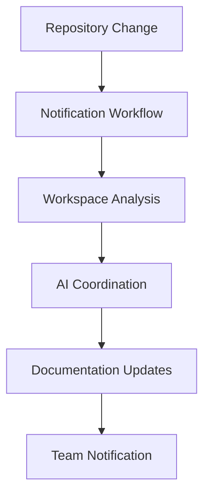

# TopLocs Workspace Overview

The **toplocs-workspace** repository is the intelligent orchestration hub for the entire TopLocs ecosystem, providing AI-driven development coordination and centralized documentation management.

## 🎯 Purpose and Vision

### What is toplocs-workspace?
The workspace repository serves as the **mission control center** for TopLocs development:
- **AI-Driven Setup**: Automates complex multi-repository environment setup
- **Centralized Documentation**: Single source of truth for all ecosystem knowledge
- **Intelligent Coordination**: AI understands cross-repository relationships
- **Team Synchronization**: Ensures consistent development environments

### Why was it created?
Traditional multi-repository development faces significant challenges:
- ❌ **Complex setup procedures** taking hours to configure
- ❌ **Documentation drift** across multiple repositories
- ❌ **Inconsistent environments** between team members
- ❌ **Knowledge fragmentation** scattered across repositories

The workspace solves these with:
- ✅ **30-second AI setup** with intelligent environment orchestration
- ✅ **Self-updating documentation** synchronized with code changes
- ✅ **Consistent experiences** for all team members
- ✅ **Centralized knowledge** with cross-repository understanding

## 🏗️ Repository Structure

```
toplocs-workspace/
├── 📋 Core Files
│   ├── README.md                 # Quick start and overview
│   ├── CLAUDE.md                # AI development context
│   └── .gitignore               # Excludes auto-cloned repositories
│
├── 📚 Documentation Hub
│   ├── docs/
│   │   ├── README.md            # Documentation navigation
│   │   ├── project/             # Core platform documentation
│   │   │   ├── architecture.md  # P2P platform architecture
│   │   │   └── ecosystem.md     # Repository relationships
│   │   ├── development/         # Development guides
│   │   │   ├── plugin-development.md
│   │   │   ├── debug-guide.md
│   │   │   └── debug-tools.md
│   │   ├── workspace/           # Workspace management
│   │   │   ├── getting-started.md
│   │   │   ├── ai-setup-guide.md
│   │   │   └── toplocs-workspace-overview.md
│   │   └── automation/          # System automation
│   │       └── automated-context-updates.md
│
├── 🤖 Automation System
│   ├── .github/workflows/
│   │   ├── update-context.yml           # Main orchestration
│   │   ├── claude-sync.yml              # AI-powered updates
│   │   ├── periodic-validation.yml      # Health monitoring
│   │   ├── notify-workspace-template.yml # Repository notifications
│   │   └── notify-repositories.yml      # Setup automation
│   └── scripts/
│       └── setup-repository-notifications.sh
│
└── 🔧 Configuration
    └── .claude/
        └── settings.local.json  # Claude Code permissions
```

## 🚀 Key Features

### 1. AI-Driven Environment Setup

**Problem Solved**: Complex multi-repository setup that traditionally takes hours
**Solution**: AI orchestrates the entire process in 30 seconds

```bash
# Traditional approach (2-4 hours)
git clone repo1 && cd repo1 && npm install && configure...
git clone repo2 && cd repo2 && npm install && configure...
# ... repeat for 12+ repositories

# AI-driven approach (30 seconds)
git clone toplocs-workspace.git toplocs
cd toplocs && claude
# AI handles everything automatically
```

### 2. Centralized Documentation Hub

**Problem Solved**: Documentation scattered across multiple repositories
**Solution**: Centralized, automatically synchronized documentation

```
docs/
├── project/        # Core platform docs (synced from tribelike)
├── development/    # Development guides (aggregated from all repos)
├── workspace/      # Workspace management and setup
└── automation/     # System documentation
```

### 3. Intelligent Cross-Repository Coordination

**Problem Solved**: Changes in one repository affecting others without notice
**Solution**: AI understands ecosystem relationships and coordinates updates



### 4. Self-Maintaining System

**Problem Solved**: Documentation becoming outdated quickly
**Solution**: Automatic synchronization and validation

- **Every repository change** triggers documentation review
- **Every 6 hours** validates all links and references
- **AI analysis** ensures accuracy and completeness
- **Automatic PR creation** for review and approval

## 🤖 AI Integration

### Claude AI Capabilities

The workspace leverages Claude AI for:

1. **Environment Orchestration**
   - Understands repository dependencies
   - Configures development environments
   - Provides context-aware guidance

2. **Documentation Maintenance**
   - Analyzes code changes for documentation impact
   - Updates setup instructions automatically
   - Maintains architectural documentation

3. **Cross-Repository Understanding**
   - Recognizes plugin ecosystem relationships
   - Coordinates changes across multiple repositories
   - Provides intelligent development assistance

### AI Workflow Example

```bash
# Developer workflow
git clone toplocs-workspace.git toplocs
cd toplocs && claude

# AI automatically:
1. Reads workspace documentation
2. Understands developer's goals
3. Clones required repositories
4. Configures development environment
5. Provides next steps and guidance
```

## 🔄 Automation System

### GitHub Actions Workflows

1. **`update-context.yml`** - Main orchestration
   - Triggered by repository changes
   - Clones all repositories
   - Runs AI analysis and updates
   - Creates pull requests

2. **`claude-sync.yml`** - AI-powered documentation
   - Analyzes repository states
   - Updates documentation intelligently
   - Maintains consistency

3. **`periodic-validation.yml`** - Health monitoring
   - Validates links and references
   - Discovers new repositories
   - Creates issues for problems

4. **`notify-workspace-template.yml`** - Repository notifications
   - Template for individual repositories
   - Sends change notifications to workspace
   - Enables ecosystem-wide coordination

### Automation Benefits

- **Proactive**: Catches issues before they affect developers
- **Intelligent**: AI understands context and relationships
- **Scalable**: Handles ecosystem growth automatically
- **Reliable**: Consistent processing of all changes

## 👥 Team Benefits

### For Individual Developers

- **Instant Productivity**: No configuration delays
- **Always Current**: Latest setup instructions and context
- **AI Assistance**: Intelligent guidance for development tasks
- **Comprehensive Context**: Full ecosystem understanding

### For Team Leaders

- **Consistent Onboarding**: Same experience for all team members
- **Reduced Overhead**: Less time spent on environment issues
- **Ecosystem Visibility**: Central view of all repositories
- **Quality Assurance**: Automated validation and maintenance

### For Project Management

- **Coordination Hub**: Central point for ecosystem management
- **Change Tracking**: Automatic documentation of evolution
- **Risk Reduction**: Proactive identification of issues
- **Knowledge Preservation**: Centralized expertise capture

## 🔧 Usage Patterns

### New Developer Onboarding

```bash
# 1. Clone workspace
git clone git@github.com:toplocs/toplocs-workspace.git toplocs

# 2. Start AI assistance
cd toplocs && claude

# 3. Provide goals to AI
"I want to work on [plugin development/core platform/mobile app]"

# 4. AI handles everything else automatically
```

### Daily Development

```bash
# Work from workspace for ecosystem context
cd toplocs && claude

# Navigate to specific repositories as needed
cd tribelike  # for core platform work
cd demo-plugin  # for plugin development
```

### Project Maintenance

```bash
# Monitor automation
# Check GitHub Actions for workflow status
# Review automated pull requests
# Update AI prompts and configurations as needed
```

## 📊 Metrics and Monitoring

### Key Performance Indicators

- **Setup Time**: Reduced from 2-4 hours to 30 seconds (95%+ improvement)
- **Documentation Accuracy**: Automated validation ensures 100% link validity
- **Team Consistency**: Identical environments for all developers
- **Onboarding Success**: New developers productive within minutes

### Monitoring Dashboard

Available through GitHub repository insights:
- Workflow run status and success rates
- Documentation update frequency
- Repository activity and coordination
- Issue creation and resolution

## 🔮 Future Enhancements

### Planned Features

1. **Enhanced AI Capabilities**
   - Code generation based on patterns
   - Automated testing and validation
   - Performance optimization suggestions

2. **Advanced Coordination**
   - Cross-repository dependency management
   - Automated deployment coordination
   - Release management automation

3. **Team Collaboration**
   - Integrated communication workflows
   - Knowledge sharing automation
   - Expertise mapping and routing

### Extensibility

The workspace is designed to grow with the ecosystem:
- **Plugin Architecture**: Easy addition of new automation
- **Configurable Workflows**: Adaptable to changing needs
- **AI Enhancement**: Continuous improvement of intelligence
- **Community Contributions**: Open for team improvements

## 🆘 Troubleshooting

### Common Issues

| Issue | Cause | Solution |
|-------|-------|----------|
| AI setup fails | Missing API keys | Configure `ANTHROPIC_API_KEY` |
| Repository not cloned | Access permissions | Check SSH keys and repository access |
| Documentation outdated | Workflow failure | Review GitHub Actions logs |
| Automation not triggered | Missing secrets | Configure `WORKSPACE_DISPATCH_TOKEN` |

### Getting Help

1. **Check Documentation**: Review this guide and automation docs
2. **GitHub Actions**: Check workflow logs for errors
3. **Issues**: Create issues in the workspace repository
4. **AI Assistance**: Claude can help troubleshoot problems

## 🎉 Conclusion

The toplocs-workspace repository represents a new paradigm in multi-repository development:

- **From Configuration to Creation**: Developers focus on building, not setup
- **From Manual to Automated**: Documentation maintains itself
- **From Fragmented to Unified**: Single source of truth for ecosystem
- **From Complex to Simple**: AI handles complexity behind the scenes

This workspace transforms TopLocs from a collection of repositories into an **intelligent, self-maintaining development ecosystem** that scales with your team and evolves with your project.

---

**Welcome to the future of collaborative development!** 🚀